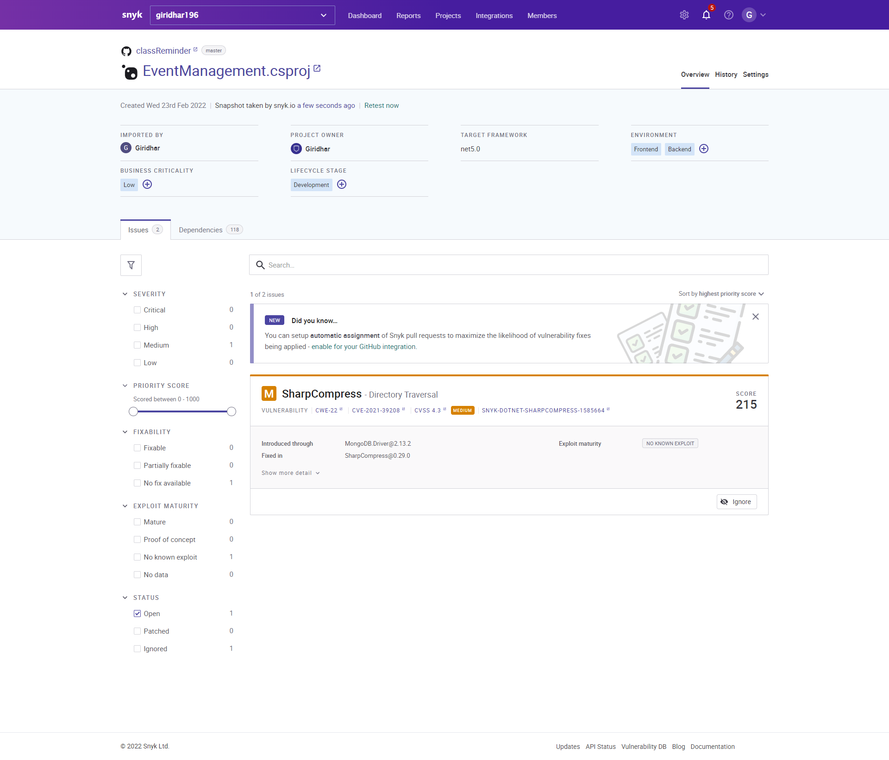

# Class Remainder App

[Test Coverage Link](https://giridhar196.github.io/classReminder/dotCover.Output.html)

### Synk Integration

## Project Code Documentation [Link](https://giridhar196.github.io/ClassReminderDocument/api/index.html)
Git hub Documentation Code [Link](https://github.com/giridhar196/ClassReminderDocument)

- We are proposing the technology stack based on c# with Dot Net, and the front end with cshtml.
- It is an fully optimized frame work which helps the company to maintaining and modifying with the latest requirements.
- The technology stack is maintained by Microsoft which can assure that we can get support and updated moving forwarded.

## External Requirements

- [Visual Studio Code](https://code.visualstudio.com/Download) (Any Version)
- Any kind of browser
- Account on the [MongoDB](https://www.mongodb.com/) for the database
- Internet connection to get and update the data.

## Setup

- Clone the code form the repo.
- Open the project in the visual studio code.
- Try to build and check if build got success.
- Setup the mongodb account and get the connection string
- Update the connection string of mongo db in the webconfig file.
- Build and start.

# Deployment

- The build will get automatically deployed once you update the code back to the github.
- [Swagger URL](https://classremindergdp.herokuapp.com/swagger)

# Testing

- Under actions you can find the automated test yaml running and updated. 
- [Sonar Test Report](https://sonarcloud.io/project/overview?id=giridhar196_classReminder)
- [Action Link](https://github.com/giridhar196/classReminder/actions/workflows/sonar.yml)
- To test the coverage we need to run the command
- dotnet dotcover test --dcReportType=HTML
- [Test Coverage Link](https://giridhar196.github.io/classReminder/dotCover.Output.html)

# Useful Links.

[Link to Wiki](https://github.com/giridhar196/classReminder/wiki)

[Link to board](https://github.com/users/giridhar196/projects/4)

[Link to all issues](https://github.com/users/giridhar196/projects/4)

[Link to milestone](https://github.com/giridhar196/classReminder/milestones)

[Link For Request For Proposal](https://github.com/harshakurra123/ClassRemainder)

[Link for the Proposal](https://github.com/giridhar196/proposal/blob/main/Proposal.md)

[Client Acceptance](https://github.com/giridhar196/classReminder/issues/1)

[Open Source Images From](https://pixabay.com/)

[Opening Page Image from NWMU University](https://www.nwmissouri.edu/)
